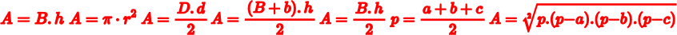
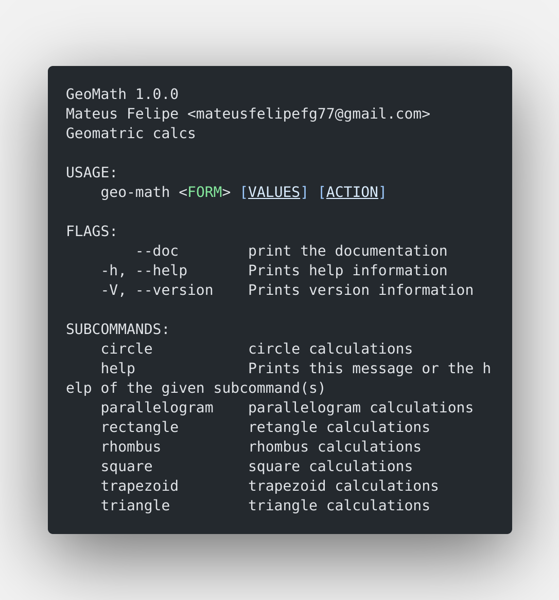

[wiki_path]: .github/assets/buttons/WIKI.png
[docs_path]: .github/assets/buttons/DOCS.png
[usage_path]: .github/assets/buttons/USAGE.png

<div align="center">

<!-- # GeoMath -->
# 
_**GEOMETRIC MATH**_

[![WIKI][wiki_path]](https://github.com/mateusfg7/GeoMath/wiki)[![DOCS][docs_path]](https://mateusfg7.github.io/GeoMath/geo_math/)[![USAGE][usage_path]](#geomath-have-support-of-seven-shapes)




</div>


### Usage

if you type 
```bash
geo-math --help
```

you will see the help menu, something like this



#### **GeoMath have support of seven shapes:**

[circle](#circle) - [parallelogram](#square-rectangle-and-parallelogram) - [rectangle](#square-rectangle-and-parallelogram) - [rhombus](#rhombus) - [square](#square-rectangle-and-parallelogram) - [trapezoid](#trapezoid) - [triangle](#triangle)

_you can type `geo-math [shape] --help`_ to get the help menu of each geometry

#### Circle


FEATURES
- **get area**

  usage: `geo-math circle --raio=[THE RAIO OF CIRCLE] [ACTION]`

  e.g:
  ```bash
  $ geo-math circle --raio=5 -a

  49.34802200544679cm
  ```
#### Square, Rectangle and Parallelogram
  

_all this shapes uses the same formula_

FEATURES

- **get area**

  usage: `geo-math [command] --base=[THE BASE OF THE SHAPE] --height=[THE HEIGHT OF THE SHAPE] [ACTION]`

  e.g:
  ```bash
  $ geo-math square --base=5 --height=5 -a

  25cm
  ```
#### Rhombus


FEATURES
- **get area**

  usage: `geo-math rhombus --lDiagonal=[LARGER DIAGONAL] --sDiagonal=[SMALLER DIAGONAL] [ACTION]`

  e.g:
  ```bash
  $ geo-math rhombus --lDiagonal=42 --sDiagonal=42 -a

  882cm
  ```
#### Trapezoid


FEATURES

- **get area**

  usage: `geo-math circle --lBase=[LARGER BASE] --sBase=[SMALLER BASE] --height=[THE HEIGHT OF SHAPE] [ACTION]`

  e.g:
  ```bash
  $ geo-math trapezoid --lBase=42 --sBase=42 --height=42 -a

  1764cm 
  ```

#### Triangle


FEATURES

- **get area**

  using base and height: `geo-math triangle --base=[THE BASE OF TRIANGLE] --height=[HEIGHT OF TRIANGLE] -a`

  e.g:
  ```bash
  $ geo-math triangle --base=42 --height=42 -a

  882cm 
  ```

  using sides: `geo-math triangle --side-a=[SIDE A] --side-b=[SIDE B] --side-c=[SIDE C] -a`

  e.g:
  ```bash
  $ geo-math triangle --side-a=42 --side-b=42 --side-c=42 -a

  763.8344cm
  ```

- **get perimeter**

  usage: `geo-math triangle --side-a=[SIDE A] --side-b=[SIDE B] --side-c=[SIDE C] -p`

  e.g:
  ```bash
  $ geo-math triangle --side-a=42 --side-b=42 --side-c=42 -p

  63cm
  ```