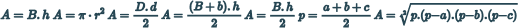
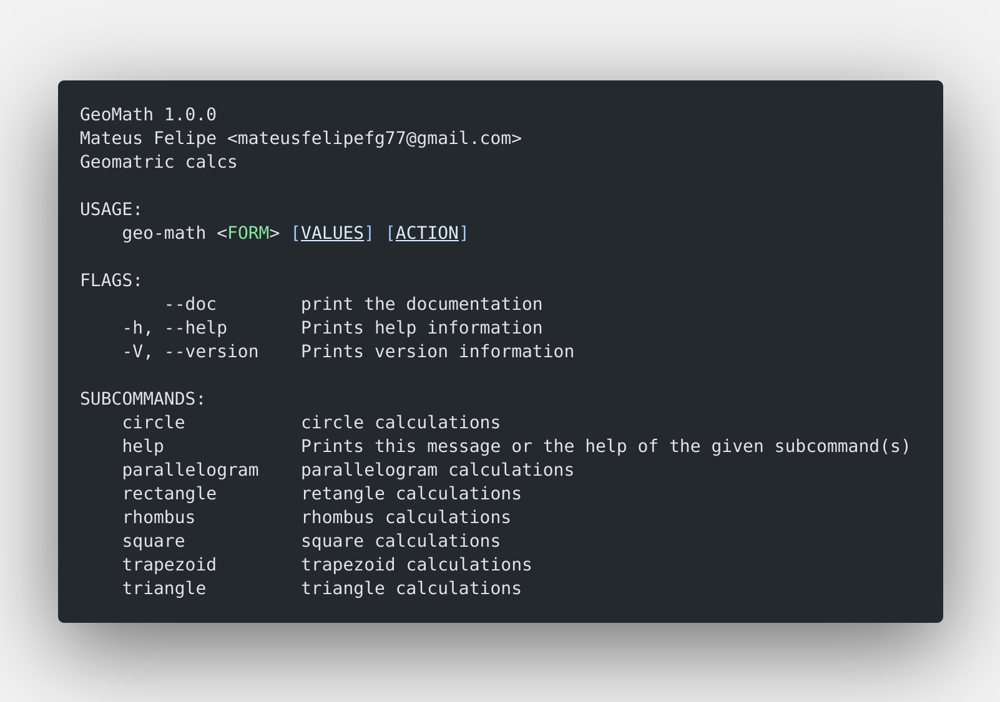

<div align="center">

<!-- # GeoMath -->
# 
_**GEOMETRIC MATH**_

[WIKI](https://github.com/mateusfg7/GeoMath/wiki) - [DOCS](https://mateusfg7.github.io/GeoMath/geo_math/) - [USAGE](#geomath-have-support-of-seven-shapes)




</div>


### Usage

if you type 
```bash
geo-math --help
```

you will see the help menu, something like this



#### **GeoMath have support of seven shapes:**

[circle](#circle) - [parallelogram](#square-rectangle-and-parallelogram) - [retangle](#square-rectangle-and-parallelogram) - [rhombus](#rhombus) - [square](#square-rectangle-and-parallelogram) - [trapezoid](#trapezoid)

_you can type `geo-math [shape] --help`_ to get the help menu of each geometry

#### Circle


Features
- get area

usage: `geo-math circle --raio=[THE RAIO OF CIRLCE] [ACTION]`

e.g:
```bash
$ geo-math circle --raio=5 -a

49.34802200544679cm
```
#### Square, Rectangle and Parallelogram

_all this shapes uses the same formula_

Features
- get area

usage: `geo-math [command] --base=[THE BASE OF THE SHAPE] --heigth=[THE HEIGTH OF THE SHAPE] [ACTION]`

e.g:
```bash
$ geo-math square --base=5 --heigth=5 -a

25cm
```
#### Rhombus

Features
- get area

usage: `geo-math rhombus --lDiagonal=[LARGER DIAGONAL] --sDiagonal=[SMALLER DIAGONAL] [ACTION]`

e.g:
```bash
$ geo-math rhombus --lDiagonal=42 --sDiagonal=42 -a

882cm
```
#### Trapezoid

Features
- get area

usage: `geo-math circle --lBase=[LARGER BASE] --sBase=[SMALLER BASE] --height=[THE HEIGHT OF SHAPE] [ACTION]`

e.g:
```bash
$ geo-math trapezoid --lBase=42 --sBase=42 --height=42 -a

1764cm 
```